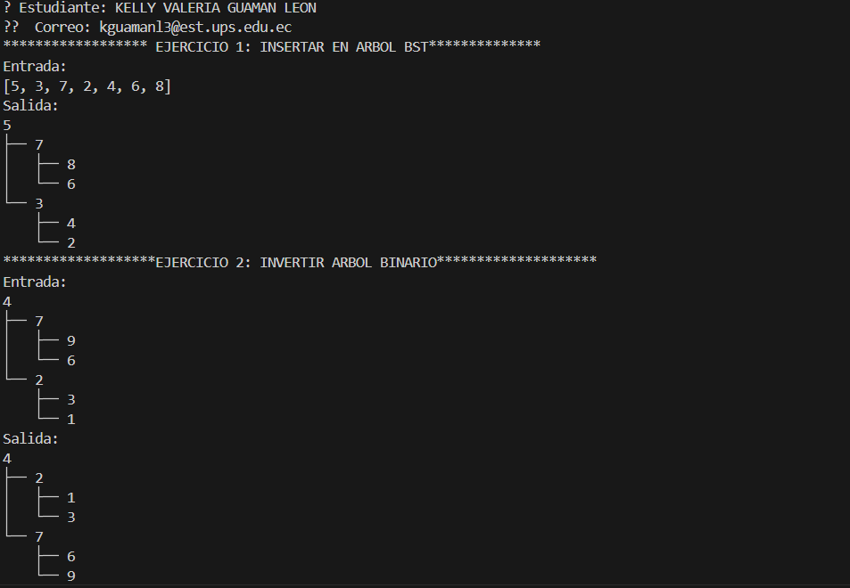
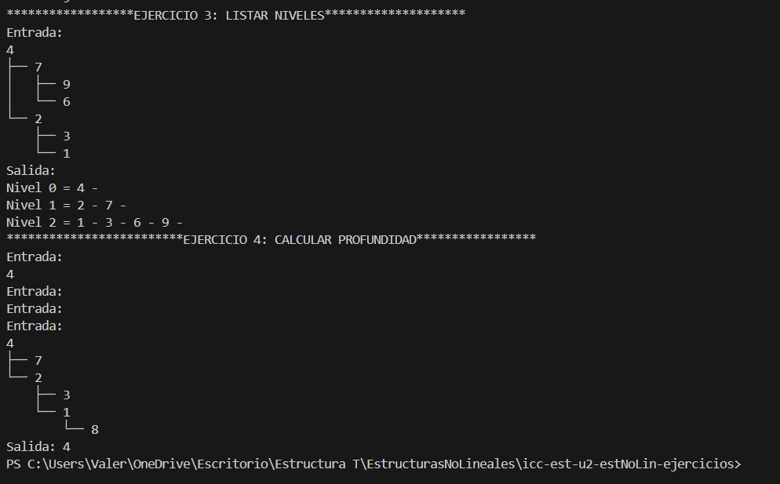

# Estructuras No Lineales
## 📌 Información General
Título: Estructuras No Lineales - Árboles Binarios

Asignatura: Estructura de Datos

Carrera: Computación

Estudiante: [Kelly Valeria Guaman Leon]

Fecha: [0/07/2025]

Profesor: Ing. Pablo Torres

# Ejercicios de Árboles Binarios en Java
Este proyecto contiene la implementación de 4 algoritmos fundamentales para trabajar con árboles binarios en Java, desarrollados como parte de la práctica de estructuras de datos no lineales.

## Ejercicio 01: Insertar en Árbol Binario de Búsqueda (BST)
Descripción:
Implementa la inserción de nodos en un Árbol Binario de Búsqueda manteniendo sus propiedades:

Los valores menores van al subárbol izquierdo

Los valores mayores van al subárbol derecho

Método Principal:

java
public Node insert(Node root, int value)
## Ejemplo:
Input: [5, 3, 7, 2, 4, 6, 8]
Output:
    5
   / \
  3   7
 / \ / \
2 4 6 8

## Ejercicio 02: Invertir Árbol Binario
Descripción:
Invierte un árbol binario intercambiando recursivamente los subárboles izquierdo y derecho de cada nodo.

Método Principal:

java
public Node invertTree(Node root)
## Ejemplo:

java
Input:
    4
   / \
  2   7
 / \ / \
1 3 6 9
Output:
    4
   / \
  7   2
 / \ / \
9 6 3 1

## Ejercicio 03: Listar Niveles en Listas Enlazadas
Descripción:
Devuelve una lista de listas donde cada lista contiene los nodos de un nivel del árbol, implementado con recorrido por niveles (BFS).

Método Principal:

java
public List<List<Node>> listLevels(Node root)
## Ejemplo:

java
Input:
    4
   / \
  2   7
 / \ / \
1 3 6 9
Output:
Nivel 0: 4
Nivel 1: 2 → 7
Nivel 2: 1 → 3 → 6 → 9

## Ejercicio 04: Calcular Profundidad Máxima
Descripción:
Calcula la profundidad máxima de un árbol binario (longitud del camino más largo desde la raíz hasta una hoja).

Método Principal:

java
public int maxDepth(Node root)

## Ejemplo:

java
Input:
    4
   /
  2
 / \
1   3
   /
  8

Output: 4
## 🚀 Ejecución del Proyecto

Ejecuta la clase App para ver los resultados de todos los ejercicios

